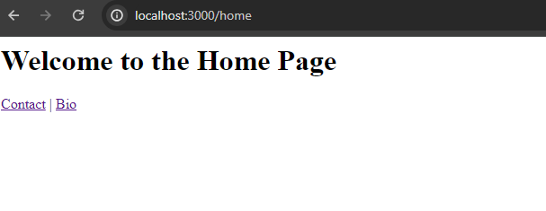
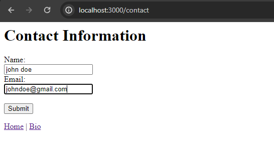
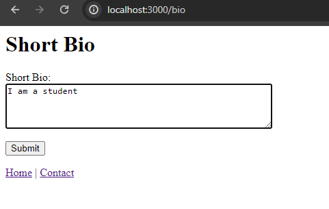
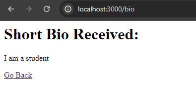

# Homework-3

Create a file with the name of ‘**webapp.js**’ and run a ‘**node.js**’ server which displays a simple website with the following routes. Please perform the following steps to perform the task.


|Link|Description|
|---|---|
|/home |	Use it for home page|
|/contact |	Enter your contact information.|
|/bio |	Add a short bio of yourself.|


1. Install **node.js** ([https://nodejs.org/en/download/](https://nodejs.org/en/download/): select LTS) and make sure npm is installed with the package.
1. Use a terminal of your choice, which is built-in software used to navigate and run commands on your computer without a graphical interface.
    - Windows terminal  (Window’s CMD terminal window)
    - **git-bash.exe** (runs after installing git, it is located under git folder, run as admin)
    - Unix based terminals
2. Using your terminal open a folder in your directory

    ```bash
    mkdir webapp
    ```

3. Select **webapp** folder

    ```bash
    cd webapp
    ```

4. Install a coding editor (i.e.“Visual Studio Code”) and create an empty file in the **webapp** folder.
    - Create **webapp.js**
5.  For package management use the following command. Default settings are OK. You can update author.

    ```bash
    npm init
    ```

6. Install express package (search on Google, how to install using npm)

7. Now create server by adding the following completed lines of code in **webapp.js**

    ```jsx
    //Require express
    const express = require ("express");

    //app object
    const app = express();

    //main page
    app.get("/", function(req,res) {
    	res.send ("Welcome to my first Node.js web site.");
    });

    //contact page
    app.get("/contact", function(req,res) {
    	res.send ("My name is ..., and ");
    });

    app.listen(8002)
    ```

8. In the terminal run the **node.js** by using the following command:
    ```bash
    node webapp.js
    ```
1. Open a web browser (i.e. Chrome)
2. Check if your server is up and running:
- Open a web browser
- Check main page at [http://localhost:8002](http://localhost:8002/)
- Check the contact page at [http://localhost:8002/contact](http://localhost:8002/contact)
1. Add **/bio** page into the webapp.js
2. Update your main page to include links to the /**contact** and /**bio** pages.
3. Take screenshots of the following:
    1. [http://localhost:8002](http://localhost:8002/)
    
    2. [http://localhost:8002/contact](http://localhost:8002/contact)
    
    
    3. [http://localhost:8002/bio](http://localhost:8002/bio)
    
    
4. Add those screenshots to your assignment folder and make sure they are submitted with your submission.

Note: If there are any unexpected problems running the **webapp.js**, you can try clearing out the browser cache.
